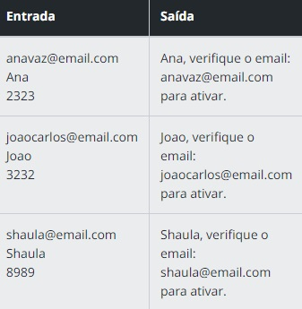
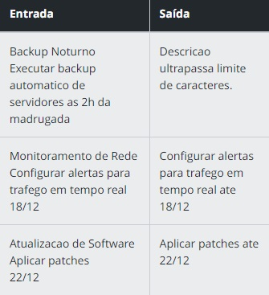
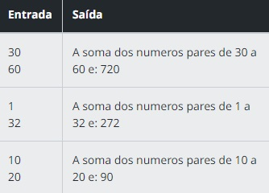
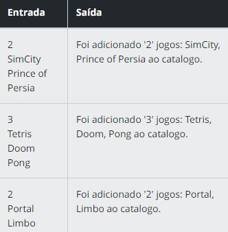
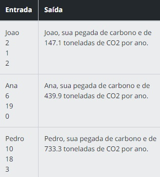

# Cshap Code Challenges

Resolução dos desafios de códigos básicos e intermediários do Programa Decola Tech 2024 da DIO em parceria com a Avanade.

## Pré-requesitos para executar os programas

> * Necessário ter o Git instalado;
> * Ter o dotnet instlado 
> * Ter uma IDE instalada de sua preferência
> * Clone o repositório;
> * Execute o programa utilizando o comando `dotnet run`


## CONVENÇÕES C# COM DESAFIOS DE CÓDIGO

> Desafios Básicos


### 1. Explorando Sintaxe e Tipos de Dados

>  Registro de Usuário

#### Descrição

Neste desafio, aplicaremos conceitos essenciais de programação, seu objetivo é desenvolver uma solução simulando o registro de usuário em uma aplicação. Assegure que o código tenha uma **sintaxe** clara e organizada, com nomenclaturas significativas para **variáveis** como `email`, `nomeUsuario`, `senha` que será o local de armazenamento das informações de registro. Escolha **tipos de dados** apropriados, como o **String** para representar o `email`, `nomeUsuario` e `senha`. Certifique-se de tratar senha como strings para operações específicas.

#### Entrada

Como entrada receberemos três informações referente ao `emailCadastro`(String), `nomeUsuario`(String) e `senha`(String).

#### Saída

Construa uma mensagem de saída formatada corretamente, como nessa estrutura: ' `registroNome` + ", verifique o email: " + `registroEmail` + " para ativar."

#### Exemplos

A tabela abaixo apresenta exemplos com alguns dados de entrada e suas respectivas saídas esperadas. Certifique-se de testar seu programa com esses exemplos e com outros casos possíveis.



#### Código Base

```c#
using System;

class Program
{
    static void Main(string[] args)
    {

// TODO: Declare as variáveis para guardar as informações de nome, email e senha:


// Obtém o email e nome do usuário a partir da entrada do console
    registroEmail = Console.ReadLine();
    registroNome = Console.ReadLine();


// TODO: Imprima a mensagem formatada com o nome do usuário e o email de registro:
    Console.WriteLine( );


    }
}
```

### 2. Dominando os Operadores

> Gerenciamento de Tarefas

#### Descrição

Agora, focaremos em outro conceito fundamental de programação para desenvolver um algoritmo que possua como objetivo a simulação de um Sistema de Gerenciamento de Tarefas. Dessa forma, crie **variáveis** como, `titulo`, `descricao` e `dataVencimento` para guardar as informações das tarefas, após isso, implemente uma **estrutura condicional** '`if/else`' para verificar se a descrição da tarefa excede 50 caracteres. Caso a descrição exceda 50 carateres, trataremos essa condição exibindo uma mensagem adequada. Lembrando que as **estruturas condicionais** são fundamentais para o controle de fluxo dos programas pois realizam verificações precisas com base em condições específicas predefinidas, neste caso, é o limite de 50 caracteres.

#### Entrada

A entrada será as `Strings` com o titulo da tarefa, a descrição e a data de vencimento.

#### Saída

Será exibido a tarefa que foi adicionada com o título, descrição e data de vencimento. Mas caso a descrição tenha mais de 50 caracteres deverá ser informado: '`O Valor da descrica excede a quantidade de caracteres permitido`'.

#### Exemplos

A tabela abaixo apresenta exemplos com alguns dados de entrada e suas respectivas saídas esperadas. Certifique-se de testar seu programa com esses exemplos e com outros casos possíveis.



#### Código Base

```c#
using System;

class Program
{
    static void Main()
    {

// TODO: Crie as variáveis titulo, descricao e dataVencimento para guardar as informações das tarefas:


 // Obtém o titulo e a descricao a partir da entrada do console
    titulo = Console.ReadLine();
    descricao = Console.ReadLine();

// TODO: Crie uma estrutura condicional 'if/else' para verificar se a descrição da tarefa excede 50 caracteres.


 // Caso a descricao esteja dentro do limite é solicitado a entrada pelo console:
    dataVencimento = Console.ReadLine();


 // TODO: Imprima a descricao e a data de vencimento como nos exemplos da tabela:

        }
    }
```

### 3. Desvendando o Controle de Fluxo

> Soma de Números Pares em Intervalo

#### Descrição

Para este desafio, vamos aplicar outros conceitos fundamentais de programação, agora, criaremos um programa que calcule a soma dos números pares em um intervalo específico. Dessa forma, desenvolva uma solução clara, simples e organizada, você pode criar **variáveis** com nomes representativos, como `limiteInferior`, `limiteSuperior` e `somaPares`. Utilize uma **estrutura** de controle de fluxo, como o `for` para percorrer todos os números no intervalo definido pelos `limiteInferior e o limiteSuperior`. Dentro desse loop, crie uma **estrutura condicional** `if ` para verificar se cada número é par e se o resto da divisão por 2 é igual a zero (`i % 2 == 0`). Se a condição for verdadeira, o número é somado à variável `somaPares`.

#### Entrada

Será as informações de `limiteInferior` e `limiteSuperior`, sendo eles dois números inteiros(`int`).

#### Saída

A saída deverá informar uma String com o resultado final: $"A soma dos números pares de {`limiteInferior`} a {`limiteSuperior`} e: {`somaPares`}".

#### Exemplos

A tabela abaixo apresenta exemplos com alguns dados de entrada e suas respectivas saídas esperadas. Certifique-se de testar seu programa com esses exemplos e com outros casos possíveis.



#### Código Base

```c#
using System;

class Program
{
    static void Main()
    {
    // Solicita ao usuário os limites inferiores e superiores
    int limiteInferior = int.Parse(Console.ReadLine());
    int limiteSuperior = int.Parse(Console.ReadLine());

    // Variável para acumular a soma dos números pares
    int somaPares = 0;

    // TODO: Crie um Loop para percorrer os números no intervalo
    // Lembre-se: O limiteSuperior deve ser menor ou igual a i;
    
    // TODO: Implemente o if para verificar se o número é par:
        
    
    // TODO: Crie o acumulador para a soma dos números pares:
           
    

    // Exibe o resultado
    Console.WriteLine($"A soma dos numeros pares de {limiteInferior} a {limiteSuperior} e: {somaPares}");
    }
}
```

### 4. Utilizando Array e Listas

> Catálogo de Jogos

#### Descrição

Neste desafio, o objetivo é criar um catálogo de jogos que permita ao usuário adicionar uma quantidade específica de jogos. Inicie solicitando a quantidade desejada e, em seguida, peça o nome de cada jogo individualmente, armazenando-os em um array chamado `nomesJogos`. Utilize um loop `for` para facilitar a adição dos jogos. Após a conclusão, exiba um resumo em uma única linha, indicando a quantidade total de jogos adicionados e a lista de nomes no catálogo.

#### Entrada

O programa inicia solicitando ao usuário que insira a quantidade de jogos que deseja adicionar ao catálogo. Em seguida, para cada jogo, o usuário é solicitado a inserir o nome do jogo.

#### Saída

Ao final da adição dos jogos, o programa exibe um resumo que inclui a quantidade total de jogos adicionados e uma lista com os nomes dos jogos separados por vírgulas. Este resumo fornece uma visão geral dos jogos que foram incluídos no catálogo.

#### Exemplos

A tabela abaixo apresenta exemplos com alguns dados de entrada e suas respectivas saídas esperadas. Certifique-se de testar seu programa com esses exemplos e com outros casos possíveis.



#### Código Base

```c#
using System;

class Program
{
    static void Main()
    {
        // Pergunta ao usuário quantos jogos deseja adicionar:
        int quantidadeJogos = int.Parse(Console.ReadLine());

        // TODO: Inicializa os arrays com base na quantidade informada pelo usuário:
       

        // TODO: Crei um Loop para adicionar jogos conforme a quantidade especificada:
       

        //TODO: Chame a função AdicionarJogo para obter o nome do jogo e armazená-lo no array:
       

        // Exibe o resumo da adição de jogos
        ExibirResumoAdicaoJogos(quantidadeJogos, nomesJogos);
    }

    static void AdicionarJogo(int indice, string[] nomes)
    {
        // Entrada do nome do jogo
        nomes[indice] = Console.ReadLine();
    }

    static void ExibirResumoAdicaoJogos(int quantidadeJogos, string[] nomes)
    {
        Console.WriteLine();
    }
}
```

### 5. Manipulando Funções

> Cálculo de Pegada de Carbono

#### Descrição

Vamos desenvolver uma ferramenta para calcular a pegada de carbono de uma pessoa, dessa forma, crie **variáveis** como `nome`, `quilometrosPorDia`, `horasDeEletronicos`, `refeicoesComCarne` para armazenar as respectivas entradas do usuário. Para o cálculo da pegada, crie uma função CalcularPegadaDeCarbono que opera através da utilização de fatores de emissão específicos para cada atividade que contribui para a pegada de carbono, sendo eles:

* `quilometrosPorDia`: fator de 0.2, é a média estimada das emissões de carbono associadas a veículos motorizados ao longo de um ano.

* `horasDeEletronicos`, fator de 0.1, é a pegada de carbono relacionada ao consumo elétrico desses dispositivos.

* `refeicoesComCarne`, fator de 0.5, é utilizado para representar as emissões associadas à produção de carne.

A pegada de carbono do usuário é calculada a partir de três fatores: transporte (quilômetros diários × 365 × 0.2), eletrônicos (horas diárias × 0.1) e consumo de carne (refeições com carne por dia × 0.5). A soma desses valores fornece a pegada de carbono total, abrangendo diversas fontes de emissões.

#### Entrada

Como entrada será recebido o `nome`(string), `quilometrosPorDia`(double), `horasDeEletronicos`(int) e refeicoesComCarne(int).

#### Saída

Exiba a pegada de carbono calculada com base nas informações fornecidas pelo usuário.

#### Exemplos

A tabela abaixo apresenta exemplos com alguns dados de entrada e suas respectivas saídas esperadas. Certifique-se de testar seu programa com esses exemplos e com outros casos possíveis.



#### Código Base

```c#
using System;

class Program
{
    static void Main()
    {
        // Solicita o nome do usuário, quilômetros percorridos por dia, 
       // Horas de uso de eletrônicos por dia e o número de refeições com carne:
       string nome = Console.ReadLine();
       double quilometrosPorDia = double.Parse(Console.ReadLine());
       int horasDeEletronicos = int.Parse(Console.ReadLine());
       int refeicoesComCarne = int.Parse(Console.ReadLine());

        // Chama o método para calcular a pegada de carbono
        double pegadaDeCarbono = CalcularPegadaDeCarbono(quilometrosPorDia, horasDeEletronicos, refeicoesComCarne);
        
        // TODO: Exiba o resultado para o usuário:
        Console.WriteLine( );

        // Aguarda a entrada do usuário antes de encerrar o programa:
        Console.ReadLine();
    }

    // TODO: Crie um método/função para calcular a pegada de carbono com base nos parâmetros fornecidos:
  

}
```

## PRATICANDO ORIENTAÇÃO A OBJETOS COM DESAFIOS DE CÓDIGO EM C#

> Desafios intermediários

###

#### Descrição

#### Entrada

#### Saída

#### Exemplos


#### Código Base

```c#

```

###

#### Descrição

#### Entrada

#### Saída

#### Exemplos


#### Código Base

```c#

```

###

#### Descrição

#### Entrada

#### Saída

#### Exemplos


#### Código Base

```c#

```

###

#### Descrição

#### Entrada

#### Saída

#### Exemplos


#### Código Base

```c#

```

###

#### Descrição

#### Entrada

#### Saída

#### Exemplos


#### Código Base

```c#

```
